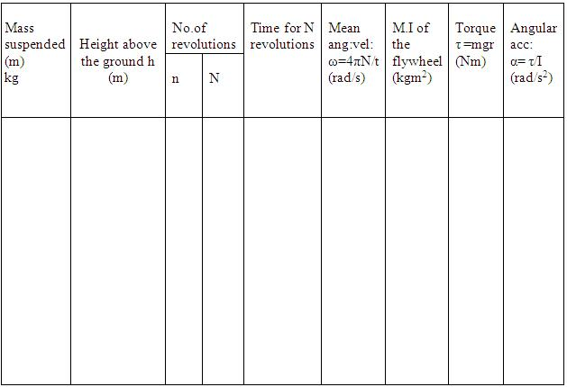

### Apparatus:
Fly wheel, weight hanger, slotted weights, stop watch, metre scale.

### Procedure for doing Simulator

<ol>
    <li>Choose any desired environment by clicking on the "combo box".</li>
    <li>Adjust the sliders to have suitable dimensions for flywheel arrangement.</li>
    <li>Click on "Release fly wheel" to start the experiment.</li>
    <li>No of revolutions (N) of the flywheel, after the loop slips off from peg is indicated on the side of axle.</li>
    <li>The time taken by flywheel,t to come to rest is noted from stop watch.</li>
    <li>Repeat the experiment for different values of variables.</li>
    <li>From the value of N,t and variables find the value of moment inertia</li>
</ol>

  $$I=\frac{Nm}{N+n}\left( \frac{2gh}{\omega^{2}}-r^{2} \right)$$
  
8. Torque of flywheel is found using the equation $\tau=mgr$, where m is the mass of weights added and r is the radius of axle.
9. From the value of torque and inertia,the angular acceleration is found using equation, $\alpha=\frac{\tau}{I}$

### Procedure for doing Real Lab

<ol>
    <li>The length of the cord is carefully adjusted, so that when the weight-hanger just touches the ground,the loop slips off the peg.</li>
    <li>A suitable weight is placed in the weight hanger</li>
    <li>A chalk mark is made on the rim so that it is against the pointer when the weight hanger just touches the ground.</li>
    <li>The other end of the cord is loosely looped around the peg keeping the weight hanger just touching the ground.</li>
    <li>The flywheel is given a suitable number (n) of rotation so that the cord is wound round the axle without overlapping.</li>
    <li>The height (h) of the weight hanger from the ground is measured.</li>
    <li>The flywheel is released.</li>
    <li>The weight hanger descends and the flywheel rotates.</li>
    <li>The cord slips off from the peg when the weight hanger just touches the ground.By this time the flywheel would have made n rotations.</li>
    <li>A stop clock is started just when the weight hanger touches the ground.</li>
    <li>The time taken by the flywheel to come to a stop is determined as t seconds.</li>
    <li>The number of rotations (N) made by the flywheel during this interval is counted.</li>
    <li>The experiment is repeated by changing the value of n and m.</li>
    <li>From these values the moment of inertia of the flywheel is calculated using equation.</li>
</ol>

$$I=\frac{Nm}{N+n}\left( \frac{2gh}{\omega^{2}}-r^{2} \right)$$

### Observations

## Result
Angular acceleration of flywheel, $\alpha$ =........rads-2

Torque of flywheel, $\tau$ =.......... Nm
