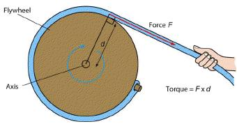

### Theory 

The flywheel consists of a heavy circular disc/massive wheel fitted with a strong axle projecting on either side.The axle is mounted on ball bearings on two fixed supports. There is a small peg on the axle. One end of a cord is loosely looped around the peg and its other end carries the weight-hanger.

  

 

Let "m" be the mass of the weight hanger and hanging rings (weight assembly).When the mass "m" descends through a height "h", the loss in potential energy is

$$P_{loss}=mgh$$

The resulting gain of kinetic energy in the rotating flywheel assembly (flywheel and axle) is

$$K_{flywheel}=\frac{1}{2}I\omega^{2}$$

Where

$I$ -moment of inertia of the flywheel assembly

$\omega$ -angular velocity at the instant the weight assembly touches the ground.

### Torque of a flywheel 

  

 

Consider a body which can be rotated.When we rotate a body, we are applying a turning force to it. The turning effect depends not only on the force but also on the place where the force is applied. So we can define the torque as,

Torque=force x perpendicular distance from the axis to the line of action of force

So for a flywheel having radius of axle r and having mass m attached to it,the torque is given by

$$\tau=mgr$$

The tendency of a moving body to change its state of motion is called inertia.If the inertia of flywheel is high,considerable amount of torque is needed to be applied.The property of inertia is applicable to every object since it is having mass. However the inertia of rotating body depends on the distribution of of its mass as well as the amount of mass.

### Angular acceleration of a flywheel

When a torque is applied to body the angular acceleration  $\alpha$ is given by 

$$\alpha=\frac{\tau}{I}$$

That is the angular acceleration depend not only on the torque $\tau$ but also on the moment of inertia $I$ of the body about the given axis which is determined by using the equation

$$I=\frac{Nm}{N+n}\left( \frac{2gh}{\omega^{2}-r^{2}} \right)$$

 Where,  
 I = Moment of inertia of the flywheel assembly  
 N = Number of rotation of the flywheel before it stopped 
m = mass of the rings 
n = Number of windings of the string on the axle 
g = Acceleration due to gravity of the environment 
h = Height of the weight assembly from the ground. 
r = Radius of the axle. 

### Applications

Flywheels can be used to store energy and used to produce very high electric power pulses for experiments, where drawing the power from the public electric network would produce unacceptable spikes. A small motor can accelerate the flywheel between the pulses.

The phenomenon of precession has to be considered when using flywheels in moving vehicles. However in one modern application, a momentum wheel is a type of flywheel useful in satellite pointing operations, in which the flywheels are used to point the satellite's instruments in the correct directions without the use of thrusters rockets.

Flywheels are used in punching machines and riveting machines. For internal combustion engine applications, the flywheel is a heavy wheel mounted on the crankshaft. The main function of a flywheel is to maintain a near constant angular velocity of the crankshaft.
